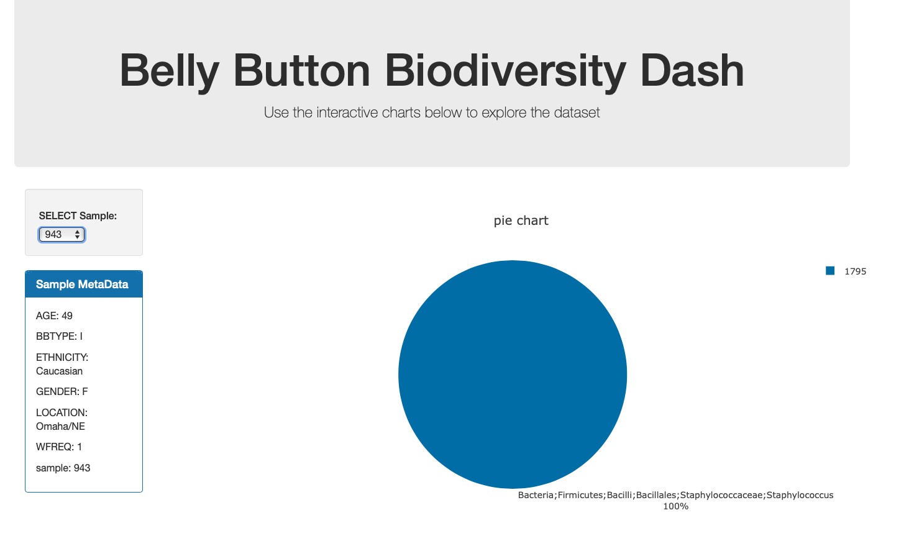
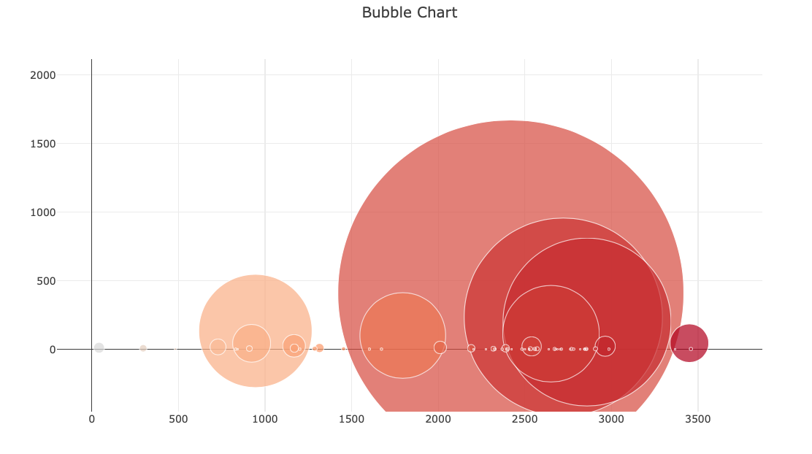

# Belly_Button_Biodiversity

An interactive dashboard that explores the [Belly Button Biodiversity DataSet](http://robdunnlab.com/projects/belly-button-biodiversity/).

Uses plotly.js to build a pie chart and a bubble chart that uses data based on user selection.

Runs on Flask.

Displays metadata from the selection.

